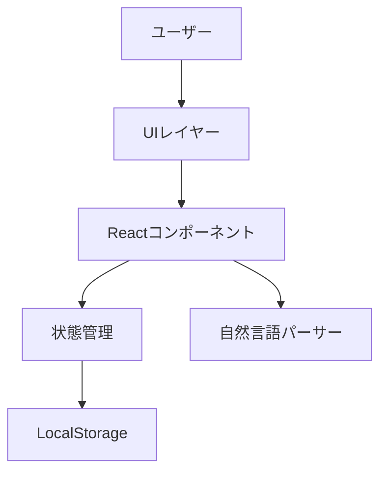
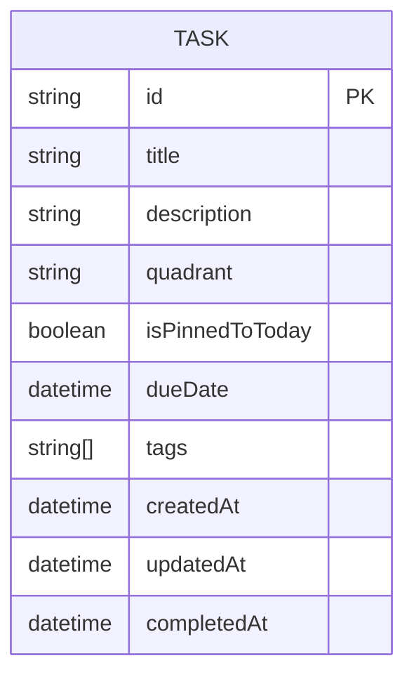
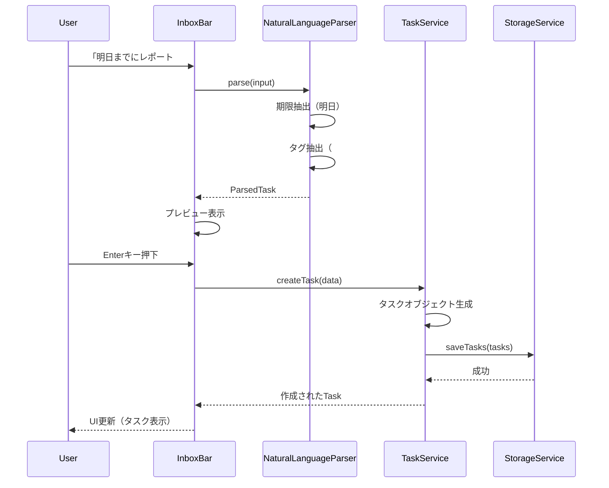
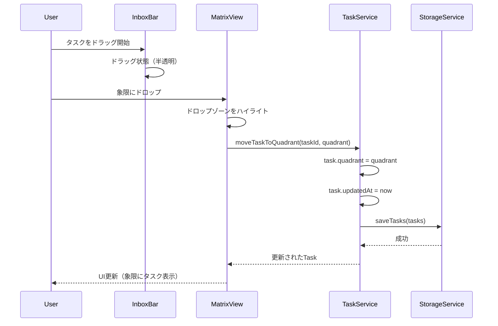
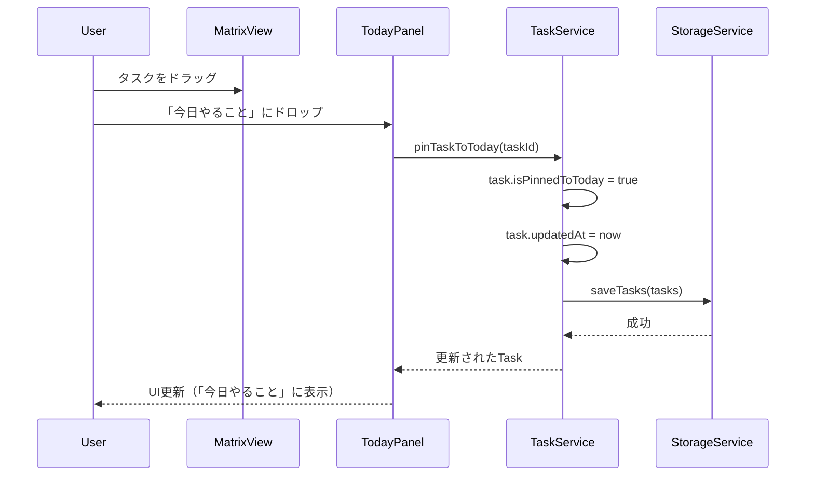

# 機能設計書 (Functional Design Document)

## システム構成図



## 技術スタック

| 分類 | 技術 | 選定理由 |
|------|------|----------|
| 言語 | TypeScript 5.x | 型安全性、エディタサポート、保守性 |
| フレームワーク | React 18 | コンポーネントベース、豊富なエコシステム |
| ビルドツール | Vite | 高速な開発サーバー、TypeScript標準サポート |
| 状態管理 | Zustand | 軽量、TypeScript親和性、学習コスト低 |
| ドラッグ&ドロップ | dnd kit | モダンなAPI、アクセシビリティ対応 |
| スタイリング | Tailwind CSS | Notionライクなシンプルデザインに最適 |
| 日付処理 | date-fns | 軽量、ツリーシェイキング対応 |
| ストレージ | LocalStorage API | サーバー不要、プライバシー保護 |

## データモデル定義

### エンティティ: Task

```typescript
interface Task {
  id: string;                    // UUID v4
  title: string;                 // 1-200文字
  description?: string;          // オプション、プレーンテキスト
  quadrant: Quadrant | null;     // 所属する象限（受信箱の場合null）
  isPinnedToToday: boolean;      // 「今日やること」にピン留めされているか
  dueDate?: Date;                // 期限
  tags: string[];                // タグリスト
  createdAt: Date;               // 作成日時
  updatedAt: Date;               // 更新日時
  completedAt?: Date;            // 完了日時
}

type Quadrant =
  | 'important-urgent'           // 重要×緊急
  | 'important-not-urgent'       // 重要×緊急でない
  | 'not-important-urgent'       // 重要でない×緊急
  | 'not-important-not-urgent';  // 重要でない×緊急でない

interface AppState {
  tasks: Task[];                 // 全タスクリスト
  isTaskModalOpen: boolean;      // タスク詳細モーダルの表示状態
  selectedTaskId: string | null; // 選択中のタスクID
}
```

**制約**:
- `title` は必須、1-200文字
- `id` はUUID v4形式
- `quadrant` が `null` の場合は受信箱に所属
- `isPinnedToToday` が `true` の場合「今日やること」に表示
- `tags` は `#` で始まる文字列の配列

### ER図



## コンポーネント設計

### UIレイヤー

#### InboxBar

**責務**:
- 受信箱の表示
- 新規タスクの追加UI
- 未分類タスクの一覧表示

**インターフェース**:
```typescript
interface InboxBarProps {
  tasks: Task[];                 // 受信箱のタスク（quadrant === null）
  onTaskCreate: (title: string) => void;
  onTaskMove: (taskId: string, quadrant: Quadrant) => void;
}

const InboxBar: React.FC<InboxBarProps>;
```

**依存関係**:
- `TaskCard`: タスクカードの表示
- `NaturalLanguageInput`: 自然言語入力コンポーネント

#### MatrixView

**責務**:
- 4象限のマトリクス表示
- 各象限へのタスク表示
- ドラッグ&ドロップのドロップゾーン

**インターフェース**:
```typescript
interface MatrixViewProps {
  tasks: Task[];                 // 全タスク
  onTaskMove: (taskId: string, quadrant: Quadrant) => void;
  onTaskClick: (taskId: string) => void;
}

const MatrixView: React.FC<MatrixViewProps>;
```

**依存関係**:
- `QuadrantCard`: 各象限コンポーネント
- `TaskCard`: タスクカードの表示

#### QuadrantCard

**責務**:
- 1つの象限の表示
- タスクリストの表示
- ドロップゾーン

**インターフェース**:
```typescript
interface QuadrantCardProps {
  quadrant: Quadrant;
  tasks: Task[];                 // この象限のタスク
  onTaskMove: (taskId: string, quadrant: Quadrant) => void;
  onTaskClick: (taskId: string) => void;
}

const QuadrantCard: React.FC<QuadrantCardProps>;
```

#### TodayPanel

**責務**:
- 「今日やること」の表示
- タスクの完了チェックボックス
- ドロップゾーン

**インターフェース**:
```typescript
interface TodayPanelProps {
  tasks: Task[];                 // isPinnedToToday === true のタスク
  onTaskComplete: (taskId: string) => void;
  onTaskUnpin: (taskId: string) => void;
}

const TodayPanel: React.FC<TodayPanelProps>;
```

#### TaskCard

**責務**:
- タスクのカード表示
- ドラッグ可能な要素
- クリックで詳細表示

**インターフェース**:
```typescript
interface TaskCardProps {
  task: Task;
  onTaskClick: (taskId: string) => void;
  isDragging?: boolean;
}

const TaskCard: React.FC<TaskCardProps>;
```

#### TaskDetailModal

**責務**:
- タスク詳細の表示
- タスクの編集
- タスクの削除

**インターフェース**:
```typescript
interface TaskDetailModalProps {
  task: Task | null;
  isOpen: boolean;
  onClose: () => void;
  onTaskUpdate: (taskId: string, updates: Partial<Task>) => void;
  onTaskDelete: (taskId: string) => void;
}

const TaskDetailModal: React.FC<TaskDetailModalProps>;
```

#### NaturalLanguageInput

**責務**:
- 自然言語入力の受付
- パース結果のプレビュー
- パースされた情報の抽出

**インターフェース**:
```typescript
interface NaturalLanguageInputProps {
  onSubmit: (parsed: ParsedTask) => void;
}

interface ParsedTask {
  title: string;
  dueDate?: Date;
  tags: string[];
}

const NaturalLanguageInput: React.FC<NaturalLanguageInputProps>;
```

### サービスレイヤー

#### TaskService

**責務**:
- タスクのCRUD操作
- ビジネスロジック

**インターフェース**:
```typescript
class TaskService {
  // タスクを作成する
  createTask(data: CreateTaskData): Task;

  // タスクを更新する
  updateTask(taskId: string, updates: Partial<Task>): Task;

  // タスクを削除する
  deleteTask(taskId: string): void;

  // タスクを象限に移動する
  moveTaskToQuadrant(taskId: string, quadrant: Quadrant): Task;

  // タスクを「今日やること」にピン留めする
  pinTaskToToday(taskId: string): Task;

  // タスクを「今日やること」から外す
  unpinTaskFromToday(taskId: string): Task;

  // タスクを完了する
  completeTask(taskId: string): Task;
}

interface CreateTaskData {
  title: string;
  description?: string;
  dueDate?: Date;
  tags?: string[];
}
```

#### NaturalLanguageParser

**責務**:
- 自然言語入力のパース
- 期限表現の認識
- タグの抽出

**インターフェース**:
```typescript
class NaturalLanguageParser {
  // 入力をパースする
  parse(input: string): ParsedTask;

  // 期限表現を抽出する
  private extractDueDate(input: string): { date?: Date; remaining: string };

  // タグを抽出する
  private extractTags(input: string): { tags: string[]; remaining: string };
}
```

**パースルール**:
- `明日` → 翌日の00:00
- `今週末` → 今週の土曜日
- `来週` → 来週の月曜日
- `YYYY-MM-DD` → 指定日
- `#タグ名` → タグとして抽出

#### StorageService

**責務**:
- LocalStorageへの保存
- データの読み込み
- データのエクスポート

**インターフェース**:
```typescript
class StorageService {
  // タスクを保存する
  saveTasks(tasks: Task[]): void;

  // タスクを読み込む
  loadTasks(): Task[];

  // データをエクスポートする
  exportAsJSON(): string;

  // データをエクスポートする（Markdown形式）
  exportAsMarkdown(): string;
}
```

## ユースケース図

### ユースケース1: タスクを受信箱に追加する



**フロー説明**:
1. ユーザーが受信箱に自然言語でタスクを入力
2. NaturalLanguageParserが期限とタグを抽出
3. パース結果をプレビュー表示
4. Enterキーで確定すると、TaskServiceがタスクを生成
5. StorageServiceがLocalStorageに保存
6. UIが更新され、受信箱にタスクが表示される

### ユースケース2: タスクをマトリクスに分類する



**フロー説明**:
1. ユーザーが受信箱のタスクをドラッグ
2. ドラッグ中はタスクが半透明で表示
3. マトリクスの象限上にホバーするとハイライト
4. ドロップすると、TaskServiceがタスクの象限を更新
5. StorageServiceが保存
6. UIが更新され、タスクが象限に表示される

### ユースケース3: タスクを「今日やること」にピン留めする



**フロー説明**:
1. ユーザーがマトリクスのタスクをドラッグ
2. 「今日やること」パネルにドロップ
3. TaskServiceがタスクをピン留め（isPinnedToToday = true）
4. StorageServiceが保存
5. UIが更新され、「今日やること」に表示される

## UI設計

### レイアウト構成

```
┌────────────────────────────────────────────────────────────┬─────────────────┐
│                         Header                             │                 │
│  MatrixTask                                    [Ctrl+K]    │                 │
├────────────────────────────────────────────────────────────┤                 │
│                      InboxBar                              │                 │
│  ┌─────────────────────────────────────────────────────┐  │   TodayPanel    │
│  │ + タスクを追加... (Ctrl+K)                           │  │                 │
│  │ ・明日までにレポート #重要                            │  │  今日やること    │
│  │ ・会議資料作成                                        │  │  ┌───────────┐  │
│  └─────────────────────────────────────────────────────┘  │  │□ タスク1   │  │
├────────────────────────────────────────────────────────────┤  │□ タスク2   │  │
│                      MatrixView                            │  │□ タスク3   │  │
│  ┌─────────────────────┬────────────────────────┐         │  └───────────┘  │
│  │  重要×緊急           │  重要×緊急でない          │         │                 │
│  │  (3)                │  (5)                   │         │                 │
│  │  ・タスク1          │  ・タスク4              │         │                 │
│  │  ・タスク2          │  ・タスク5              │         │                 │
│  ├─────────────────────┼────────────────────────┤         │                 │
│  │  重要でない×緊急      │  重要でない×緊急でない    │         │                 │
│  │  (2)                │  (1)                   │         │                 │
│  │  ・タスク3          │  ・タスク6              │         │                 │
│  └─────────────────────┴────────────────────────┘         │                 │
└────────────────────────────────────────────────────────────┴─────────────────┘
```

### カラーコーディング

**象限の色分け（背景色）**:
- 重要×緊急: `bg-red-50` / 淡い赤（最優先）
- 重要×緊急でない: `bg-blue-50` / 淡い青（スケジュール）
- 重要でない×緊急: `bg-yellow-50` / 淡い黄（委任）
- 重要でない×緊急でない: `bg-gray-50` / 淡いグレー（削除検討）

**タスクカードの状態**:
- 通常: `bg-white` / 白
- ホバー: `bg-gray-50` / 淡いグレー
- ドラッグ中: `opacity-50` / 半透明
- 完了: `line-through text-gray-400` / 取り消し線

### キーボードショートカット

| ショートカット | 機能 |
|--------------|------|
| `Ctrl+K` (macOS: `Cmd+K`) | タスク追加モーダルを開く |
| `Enter` | タスクを追加/確定 |
| `Esc` | モーダルを閉じる |
| `?` | ショートカット一覧を表示 |
| `Tab` | フォーカス移動 |

### ドラッグ&ドロップの視覚的フィードバック

**ドラッグ開始**:
- ドラッグ中のタスクカード: `opacity-50`
- カーソル: `cursor-grabbing`

**ドラッグ中**:
- ドロップ可能なエリア: `border-2 border-blue-400 bg-blue-50`
- ドロップ不可エリア: 変化なし

**ドロップ完了**:
- アニメーション: `transition-all duration-200`
- 即座にUIが更新される

## アルゴリズム設計

### 自然言語パース

**目的**: ユーザーの自然言語入力から期限とタグを抽出

#### ステップ1: 期限表現の抽出

**認識パターン**:
- `明日`: 翌日の00:00
- `今週末`: 今週の土曜日00:00
- `来週`: 来週の月曜日00:00
- `YYYY-MM-DD`: 指定日の00:00
- `MM/DD`: 今年の指定日00:00

**実装例**:
```typescript
function extractDueDate(input: string): { date?: Date; remaining: string } {
  const patterns = [
    { regex: /明日/g, offset: 1 },
    { regex: /今週末/g, offset: 'weekend' },
    { regex: /来週/g, offset: 'next-week' },
    { regex: /(\d{4})-(\d{2})-(\d{2})/g, type: 'absolute' },
  ];

  for (const pattern of patterns) {
    const match = input.match(pattern.regex);
    if (match) {
      const date = calculateDate(pattern);
      const remaining = input.replace(pattern.regex, '').trim();
      return { date, remaining };
    }
  }

  return { remaining: input };
}
```

#### ステップ2: タグの抽出

**認識パターン**:
- `#タグ名`: タグとして抽出
- 複数可: `#重要 #緊急`

**実装例**:
```typescript
function extractTags(input: string): { tags: string[]; remaining: string } {
  const tagPattern = /#(\w+)/g;
  const tags: string[] = [];
  let match;

  while ((match = tagPattern.exec(input)) !== null) {
    tags.push(match[1]);
  }

  const remaining = input.replace(tagPattern, '').trim();
  return { tags, remaining };
}
```

#### ステップ3: 統合パース

**実装例**:
```typescript
class NaturalLanguageParser {
  parse(input: string): ParsedTask {
    // 1. 期限を抽出
    const { date: dueDate, remaining: afterDate } = this.extractDueDate(input);

    // 2. タグを抽出
    const { tags, remaining: title } = this.extractTags(afterDate);

    return {
      title: title || input,  // パース失敗時は元の文字列
      dueDate,
      tags,
    };
  }
}
```

## ファイル構造

### プロジェクト構造

```
src/
├── components/           # Reactコンポーネント
│   ├── InboxBar.tsx
│   ├── MatrixView.tsx
│   ├── QuadrantCard.tsx
│   ├── TodayPanel.tsx
│   ├── TaskCard.tsx
│   ├── TaskDetailModal.tsx
│   └── NaturalLanguageInput.tsx
├── services/             # ビジネスロジック
│   ├── TaskService.ts
│   ├── NaturalLanguageParser.ts
│   └── StorageService.ts
├── stores/               # 状態管理
│   └── taskStore.ts
├── types/                # 型定義
│   └── task.ts
├── utils/                # ユーティリティ
│   └── date.ts
└── App.tsx               # メインアプリ
```

### LocalStorageのデータ構造

**キー**: `matrixtask-data`

**値（JSON）**:
```json
{
  "tasks": [
    {
      "id": "550e8400-e29b-41d4-a716-446655440000",
      "title": "明日までにレポート作成",
      "description": "",
      "quadrant": "important-urgent",
      "isPinnedToToday": true,
      "dueDate": "2026-02-12T00:00:00.000Z",
      "tags": ["重要"],
      "createdAt": "2026-02-11T10:00:00.000Z",
      "updatedAt": "2026-02-11T10:00:00.000Z"
    }
  ],
  "version": "1.0.0"
}
```

## パフォーマンス最適化

- **Reactのメモ化**: `React.memo` を使用して不要な再レンダリングを防ぐ
- **仮想化**: タスクが500件を超える場合、仮想スクロールを検討（Post-MVP）
- **LocalStorageの最適化**: 変更があったタスクのみ更新（差分更新）
- **ドラッグ&ドロップ**: `requestAnimationFrame` を使用して60fps維持

## セキュリティ考慮事項

- **XSS対策**: Reactのデフォルトのエスケープ機能を活用。`dangerouslySetInnerHTML` は使用しない
- **LocalStorageの制限**: 5MB以内に収まるよう、タスク数の上限を設定（MVP: 500件）
- **データのサニタイズ**: ユーザー入力はすべてトリムとバリデーションを実施

## エラーハンドリング

### エラーの分類

| エラー種別 | 処理 | ユーザーへの表示 |
|-----------|------|-----------------|
| タスク作成失敗（タイトル空） | 処理を中断、エラーメッセージ表示 | 「タスクのタイトルを入力してください」 |
| LocalStorage保存失敗（容量超過） | 処理を中断、エラーメッセージ表示 | 「ストレージ容量が不足しています。古いタスクを削除してください」 |
| LocalStorage読み込み失敗 | 空の初期データで継続 | 「データの読み込みに失敗しました。新規作成します」 |
| タスクが見つからない | 処理を中断、エラーメッセージ表示 | 「タスクが見つかりません」 |
| ドラッグ&ドロップ失敗 | タスクを元の位置に戻す | 「移動に失敗しました」 |

## テスト戦略

### ユニットテスト

**対象**:
- `NaturalLanguageParser`: パースロジックのテスト
  - 期限表現の認識
  - タグ抽出
  - エッジケース（空文字列、特殊文字）
- `TaskService`: CRUD操作のテスト
  - タスク作成、更新、削除
  - ビジネスロジック（ピン留め、完了）
- `StorageService`: LocalStorage操作のテスト
  - 保存、読み込み
  - エクスポート

### 統合テスト

**シナリオ**:
- タスクを受信箱に追加し、マトリクスに移動し、「今日やること」にピン留めし、完了する一連の流れ
- 複数タスクのドラッグ&ドロップ操作
- キーボードショートカットによる操作

### E2Eテスト

**シナリオ**:
- 初回アクセス時のオンボーディング
- タスク追加→分類→完了の一連の流れ
- ページリロード後のデータ復元
- ショートカットキーの動作確認
